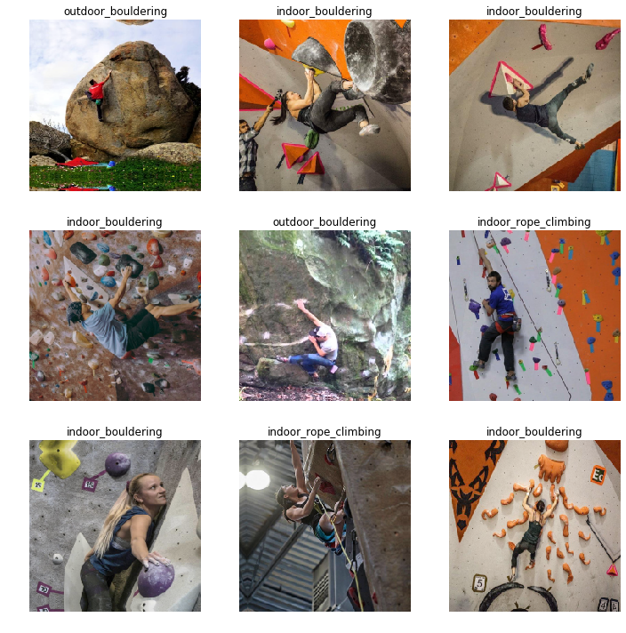
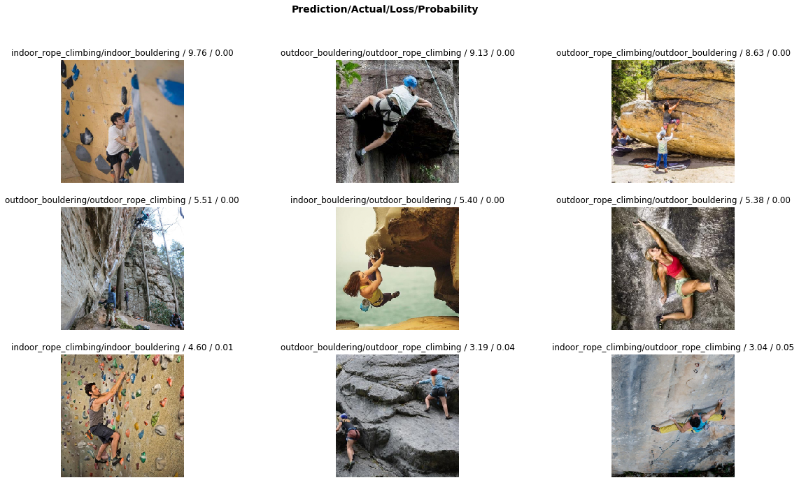
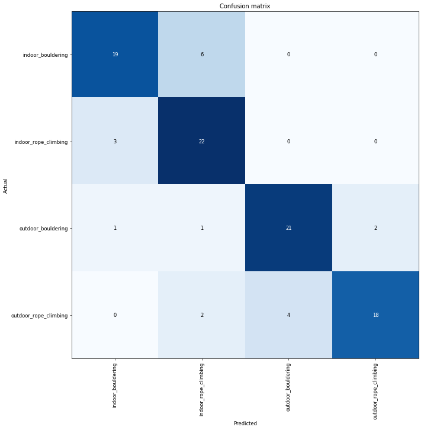
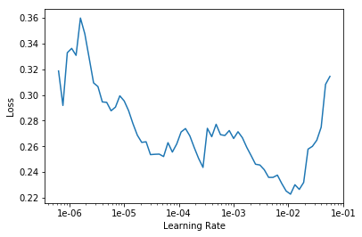
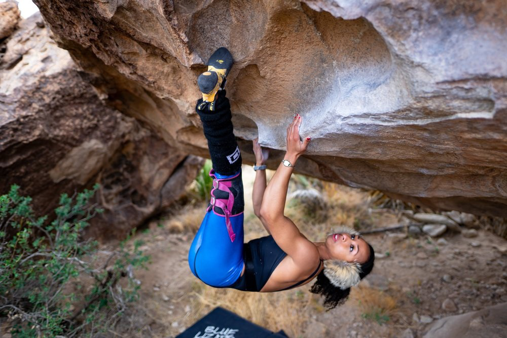
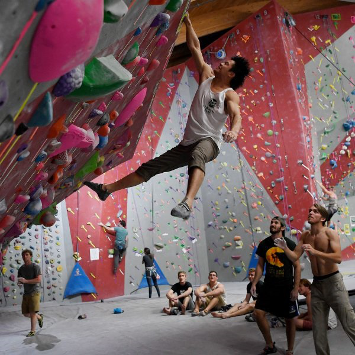
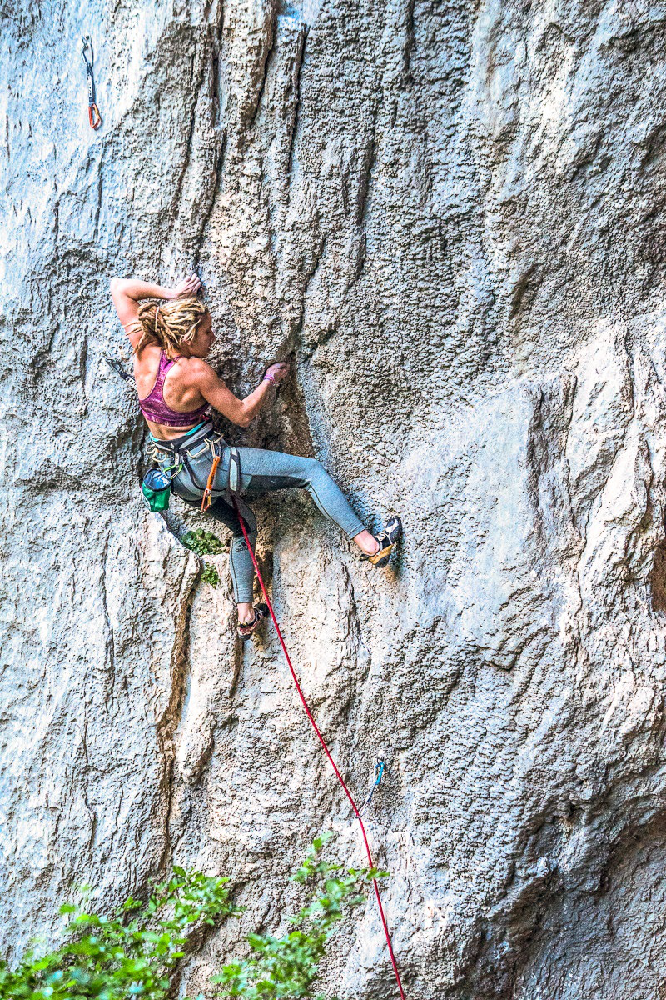
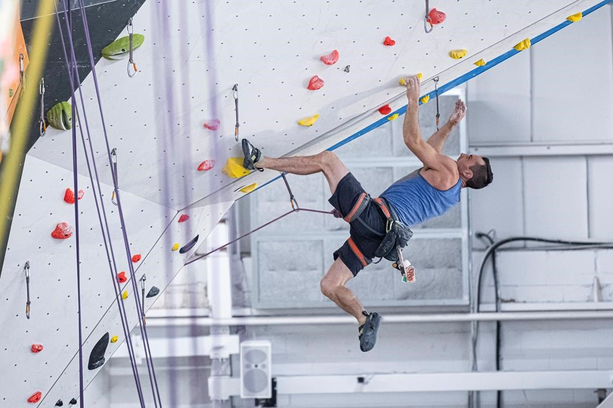

# **TRAIN RESNET50**


```python
%reload_ext autoreload
%autoreload 2
%matplotlib inline
```


```python
import fastai
import torch
import platform
from fastai.vision import *
from fastai.metrics import error_rate
```


```python
fastai.__version__
```


    '1.0.60'


```python
torch.__version__
```


    '1.4.0'


```python
platform.sys.version
```


    '3.6.8 |Anaconda, Inc.| (default, Dec 30 2018, 01:22:34) \n[GCC 7.3.0]'


```python
inputPath = Path('../../input/lesson1')
inputPath.ls()
```


    [PosixPath('../../input/lesson1/train'),
     PosixPath('../../input/lesson1/.ipynb_checkpoints'),
     PosixPath('../../input/lesson1/test'),
     PosixPath('../../input/lesson1/valid')]


```python
outputPath = Path('../../output/lesson1')
outputPath.ls()
```


    []


```python
tfms = get_transforms(do_flip=False)
size = 224
bs = 16
```


```python
data = ImageDataBunch.from_folder(inputPath, test='test', ds_tfms=tfms, size=size, bs=bs).normalize(imagenet_stats)
```


```python
data
```


    ImageDataBunch;
    
    Train: LabelList (278 items)
    x: ImageList
    Image (3, 224, 224),Image (3, 224, 224),Image (3, 224, 224),Image (3, 224, 224),Image (3, 224, 224)
    y: CategoryList
    outdoor_bouldering,outdoor_bouldering,outdoor_bouldering,outdoor_bouldering,outdoor_bouldering
    Path: ../../input/lesson1;
    
    Valid: LabelList (99 items)
    x: ImageList
    Image (3, 224, 224),Image (3, 224, 224),Image (3, 224, 224),Image (3, 224, 224),Image (3, 224, 224)
    y: CategoryList
    outdoor_bouldering,outdoor_bouldering,outdoor_bouldering,outdoor_bouldering,outdoor_bouldering
    Path: ../../input/lesson1;
    
    Test: LabelList (9 items)
    x: ImageList
    Image (3, 224, 224),Image (3, 224, 224),Image (3, 224, 224),Image (3, 224, 224),Image (3, 224, 224)
    y: EmptyLabelList
    ,,,,
    Path: ../../input/lesson1


```python
data.show_batch(rows=3, figsize=(10,10), ds_type=DatasetType.Train)
```


    

    


```python
data.show_batch(rows=3, figsize=(10,10), ds_type=DatasetType.Valid)
```


    

    


```python
data.show_batch(rows=3, figsize=(10,10), ds_type=DatasetType.Test)
```


    

    


```python
learn = cnn_learner(data, models.resnet50, metrics=error_rate)
```

    Downloading: "https://download.pytorch.org/models/resnet50-19c8e357.pth" to /home/onepanel/.cache/torch/checkpoints/resnet50-19c8e357.pth
    


    HBox(children=(IntProgress(value=0, max=102502400), HTML(value='')))


    
    


```python
learn.path = outputPath
```


```python
learn.fit_one_cycle(5)
```


<table border="1" class="dataframe">
  <thead>
    <tr style="text-align: left;">
      <th>epoch</th>
      <th>train_loss</th>
      <th>valid_loss</th>
      <th>error_rate</th>
      <th>time</th>
    </tr>
  </thead>
  <tbody>
    <tr>
      <td>0</td>
      <td>1.440729</td>
      <td>0.802152</td>
      <td>0.272727</td>
      <td>00:17</td>
    </tr>
    <tr>
      <td>1</td>
      <td>1.110702</td>
      <td>1.075032</td>
      <td>0.212121</td>
      <td>00:13</td>
    </tr>
    <tr>
      <td>2</td>
      <td>0.857157</td>
      <td>0.855767</td>
      <td>0.181818</td>
      <td>00:13</td>
    </tr>
    <tr>
      <td>3</td>
      <td>0.663188</td>
      <td>0.789394</td>
      <td>0.222222</td>
      <td>00:13</td>
    </tr>
    <tr>
      <td>4</td>
      <td>0.544032</td>
      <td>0.774920</td>
      <td>0.191919</td>
      <td>00:13</td>
    </tr>
  </tbody>
</table>


```python
learn.save('climbing-classifier-stage-1', return_path=True)
```


    PosixPath('../../output/lesson1/models/climbing-classifier-stage-1.pth')


```python
interp = ClassificationInterpretation.from_learner(learn)
losses,idxs = interp.top_losses()
len(data.valid_ds)==len(losses)==len(idxs)
```


    True


```python
interp.plot_top_losses(9, figsize=(20,11))
```


    

    


```python
interp.plot_confusion_matrix(figsize=(12,12), dpi=60)
```


    

    


```python
interp.most_confused(min_val=1)
```


    [('indoor_bouldering', 'indoor_rope_climbing', 6),
     ('outdoor_rope_climbing', 'outdoor_bouldering', 4),
     ('indoor_rope_climbing', 'indoor_bouldering', 3),
     ('outdoor_bouldering', 'outdoor_rope_climbing', 2),
     ('outdoor_rope_climbing', 'indoor_rope_climbing', 2),
     ('outdoor_bouldering', 'indoor_bouldering', 1),
     ('outdoor_bouldering', 'indoor_rope_climbing', 1)]


```python
learn.lr_find()
```


    <div>
        <style>
            /* Turns off some styling */
            progress {
                /* gets rid of default border in Firefox and Opera. */
                border: none;
                /* Needs to be in here for Safari polyfill so background images work as expected. */
                background-size: auto;
            }
            .progress-bar-interrupted, .progress-bar-interrupted::-webkit-progress-bar {
                background: #F44336;
            }
        </style>
      <progress value='4' class='' max='6' style='width:300px; height:20px; vertical-align: middle;'></progress>
      66.67% [4/6 00:41<00:20]
    </div>

<table border="1" class="dataframe">
  <thead>
    <tr style="text-align: left;">
      <th>epoch</th>
      <th>train_loss</th>
      <th>valid_loss</th>
      <th>error_rate</th>
      <th>time</th>
    </tr>
  </thead>
  <tbody>
    <tr>
      <td>0</td>
      <td>0.347631</td>
      <td>#na#</td>
      <td>00:10</td>
    </tr>
    <tr>
      <td>1</td>
      <td>0.253952</td>
      <td>#na#</td>
      <td>00:10</td>
    </tr>
    <tr>
      <td>2</td>
      <td>0.266106</td>
      <td>#na#</td>
      <td>00:10</td>
    </tr>
    <tr>
      <td>3</td>
      <td>0.257824</td>
      <td>#na#</td>
      <td>00:09</td>
    </tr>
  </tbody>
</table><p>

    <div>
        <style>
            /* Turns off some styling */
            progress {
                /* gets rid of default border in Firefox and Opera. */
                border: none;
                /* Needs to be in here for Safari polyfill so background images work as expected. */
                background-size: auto;
            }
            .progress-bar-interrupted, .progress-bar-interrupted::-webkit-progress-bar {
                background: #F44336;
            }
        </style>
      <progress value='9' class='' max='17' style='width:300px; height:20px; vertical-align: middle;'></progress>
      52.94% [9/17 00:06<00:06 0.5511]
    </div>


    LR Finder is complete, type {learner_name}.recorder.plot() to see the graph.
    


```python
learn.recorder.plot()
```


    

    


```python
learn.unfreeze()
learn.fit_one_cycle(5, max_lr=slice(1e-5,1e-2))
```


<table border="1" class="dataframe">
  <thead>
    <tr style="text-align: left;">
      <th>epoch</th>
      <th>train_loss</th>
      <th>valid_loss</th>
      <th>error_rate</th>
      <th>time</th>
    </tr>
  </thead>
  <tbody>
    <tr>
      <td>0</td>
      <td>0.368291</td>
      <td>1.960949</td>
      <td>0.232323</td>
      <td>00:14</td>
    </tr>
    <tr>
      <td>1</td>
      <td>0.700787</td>
      <td>0.786045</td>
      <td>0.151515</td>
      <td>00:14</td>
    </tr>
    <tr>
      <td>2</td>
      <td>0.732972</td>
      <td>2.324733</td>
      <td>0.303030</td>
      <td>00:14</td>
    </tr>
    <tr>
      <td>3</td>
      <td>0.634380</td>
      <td>0.599070</td>
      <td>0.171717</td>
      <td>00:14</td>
    </tr>
    <tr>
      <td>4</td>
      <td>0.467080</td>
      <td>0.579056</td>
      <td>0.141414</td>
      <td>00:14</td>
    </tr>
  </tbody>
</table>


```python
interp = ClassificationInterpretation.from_learner(learn)
losses,idxs = interp.top_losses()
len(data.valid_ds)==len(losses)==len(idxs)
```


    True


```python
learn.save('climbing-classifier-stage-2', return_path=True)
```


    PosixPath('../../output/lesson1/models/climbing-classifier-stage-2.pth')


```python
learn.fit_one_cycle(5, max_lr=slice(1e-5,1e-2))
```


<table border="1" class="dataframe">
  <thead>
    <tr style="text-align: left;">
      <th>epoch</th>
      <th>train_loss</th>
      <th>valid_loss</th>
      <th>error_rate</th>
      <th>time</th>
    </tr>
  </thead>
  <tbody>
    <tr>
      <td>0</td>
      <td>0.321460</td>
      <td>0.331845</td>
      <td>0.141414</td>
      <td>00:14</td>
    </tr>
    <tr>
      <td>1</td>
      <td>0.324293</td>
      <td>0.788780</td>
      <td>0.141414</td>
      <td>00:14</td>
    </tr>
    <tr>
      <td>2</td>
      <td>0.470533</td>
      <td>0.504817</td>
      <td>0.121212</td>
      <td>00:14</td>
    </tr>
    <tr>
      <td>3</td>
      <td>0.487498</td>
      <td>0.583008</td>
      <td>0.111111</td>
      <td>00:14</td>
    </tr>
    <tr>
      <td>4</td>
      <td>0.391195</td>
      <td>0.294424</td>
      <td>0.111111</td>
      <td>00:14</td>
    </tr>
  </tbody>
</table>


```python
interp = ClassificationInterpretation.from_learner(learn)
losses,idxs = interp.top_losses()
len(data.valid_ds)==len(losses)==len(idxs)
```


    True


```python
learn.save('climbing-classifier-stage-3', return_path=True)
```


    PosixPath('../../output/lesson1/models/climbing-classifier-stage-3.pth')


# **PREDICT**


```python
testPath = Path('../../input/lesson1/test')
testPath.ls()
```


    [PosixPath('../../input/lesson1/test/out_bould_1.jpg'),
     PosixPath('../../input/lesson1/test/ind_bould_1.jpg'),
     PosixPath('../../input/lesson1/test/out_rope_climb_1.jpg'),
     PosixPath('../../input/lesson1/test/out_bould_2.jpg'),
     PosixPath('../../input/lesson1/test/ind_rope_climb_2.jpg'),
     PosixPath('../../input/lesson1/test/out_rope_climb_2.jpg'),
     PosixPath('../../input/lesson1/test/ind_rope_climb_1.jpg'),
     PosixPath('../../input/lesson1/test/ind_bould_2.jpg'),
     PosixPath('../../input/lesson1/test/ind_rope_climb_3.jpg')]


```python
testData = ImageList.from_folder(testPath)
```


```python
testData.items[0]
```


    PosixPath('../../input/lesson1/test/out_bould_1.jpg')


```python
testData[0]
```


    

    


```python
learn.predict(testData[0])
```


    (Category outdoor_bouldering,
     tensor(2),
     tensor([6.6412e-08, 1.3783e-10, 1.0000e+00, 3.1068e-08]))


```python
testData[1]
```


    

    


```python
learn.predict(testData[1])
```


    (Category indoor_bouldering,
     tensor(0),
     tensor([9.4221e-01, 5.7358e-02, 9.8415e-07, 4.2674e-04]))


```python
testData[2]
```


    

    


```python
learn.predict(testData[2])
```


    (Category outdoor_rope_climbing,
     tensor(3),
     tensor([1.6708e-08, 8.7990e-07, 1.5879e-06, 1.0000e+00]))


```python
testData[3]
```


    

    


```python
learn.predict(testData[3])
```


    (Category outdoor_rope_climbing,
     tensor(3),
     tensor([5.6106e-07, 1.2652e-07, 7.2173e-03, 9.9278e-01]))


```python
testData[4]
```


    

    


```python
learn.predict(testData[4])
```


    (Category indoor_rope_climbing,
     tensor(1),
     tensor([1.2935e-08, 1.0000e+00, 1.3879e-12, 1.8977e-08]))


```python
testData[5]
```


```python
testData[6]
```


```python
testData[7]
```


```python
testData[8]
```


```python

```


```python

```
