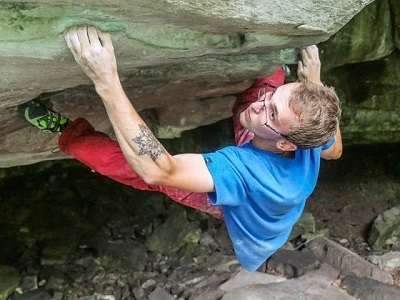
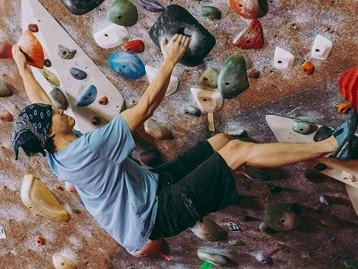
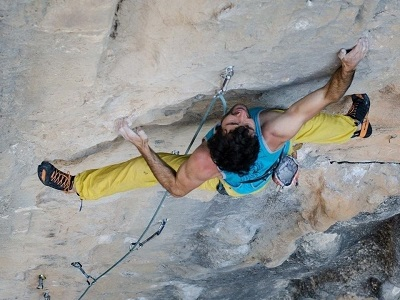
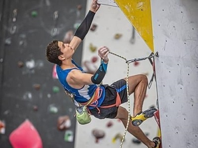
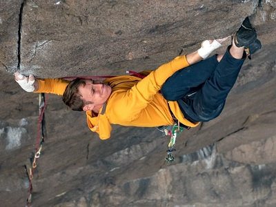

# FastAIClimbingStyleClassification
### Overview
This is a "homework" project for the first lesson of the [FastAI](https://course19.fast.ai/) course featuring image classification problem. I am a big fan of rock climbing, so I decided to train my ML model to differentiate between five different styles of climbing:

| Outdoor | Indoor |
| --- | --- |
| Bouldering  | Bouldering  |
| Sport climbing  | Sport climbing  |
| Trad climbing  | |

In short and general terms, bouldering is a type of climbing where climbers do not use any gear or hardware as they climb - they only use climbing pads on the ground to protect their falls, and most of the time climbers go as high as 10 to 20 feet above the ground. Sport and trad climbing is when climbers use rope and specialized hardware to protect them from falling to the ground as they climb as high as 100+ feet above the ground.

It is a challenging task to identify which style of climbing it is, because pictures can be taken from different angles, climbing environment and background varies (color of the rock, color of the indoor walls and holds, etc.), climber's outfits are very different as well as the movements they are performing. Telling the difference between the outdoor and indoor climbing could be generally considered an easy task, because climbing gyms have a more colourful walls and holds, and these colors are not really seen outdoors. However, differentiating between styles withing these two subgroups is still tricky. For the indoor climbing that relates to the fact that in the same shot we could see climber bouldering in the foreground, but in the background there could be ropes (or technically a person could be doing bouldering in the same area where people do roped climbing). For the outdoor climbing making a difference between bouldering and sport/trad climbing could be as easier task, but for the trad and sport climbing it could be tricky, because the gear used for climbing looks similar, and the differences lie in the nuances of how climbers climb the rock and how they place the gear to stay safe. So let's see what results we going to get at the end of this project using FastAI library.

### Project components

### Technical details

### Jupyter notebook contents

### Lessons learned