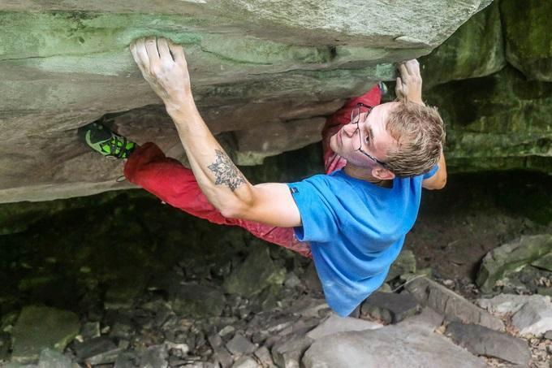

# FastAIClimbingStyleClassification
### Overview
This is a "homework" project for the first lesson of the  course featuring image classification problem. I am a big fan of rock climbing, so I decided to train my ML model to differentiate between five different styles of climbing:
1) Outdoor bouldering

2) Outdoor sport climbing

3) Outdoor trad climbing

4) Indoor bouldering

5) Indoor sport climbing

### Project components

### Technical details

### Jupyter notebook contents

### Lessons learned